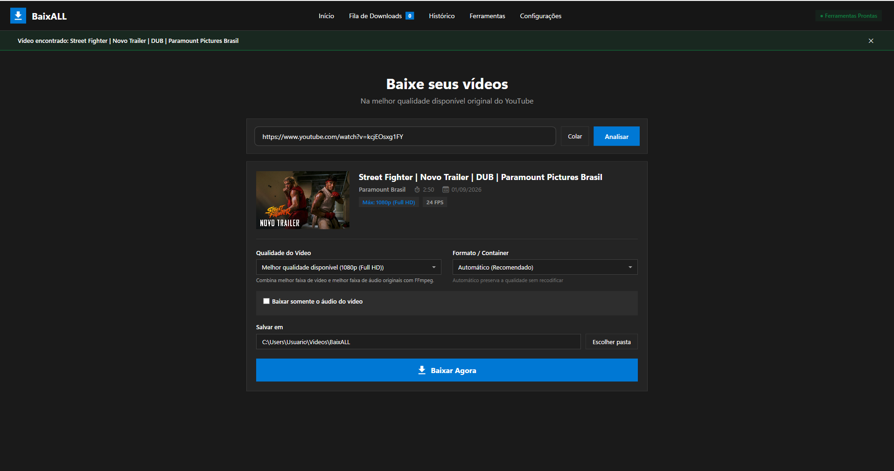
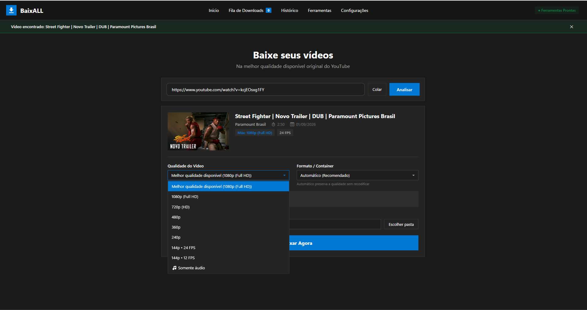
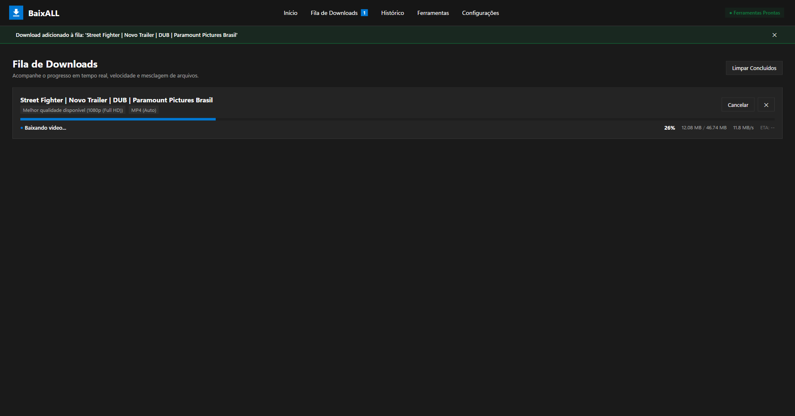
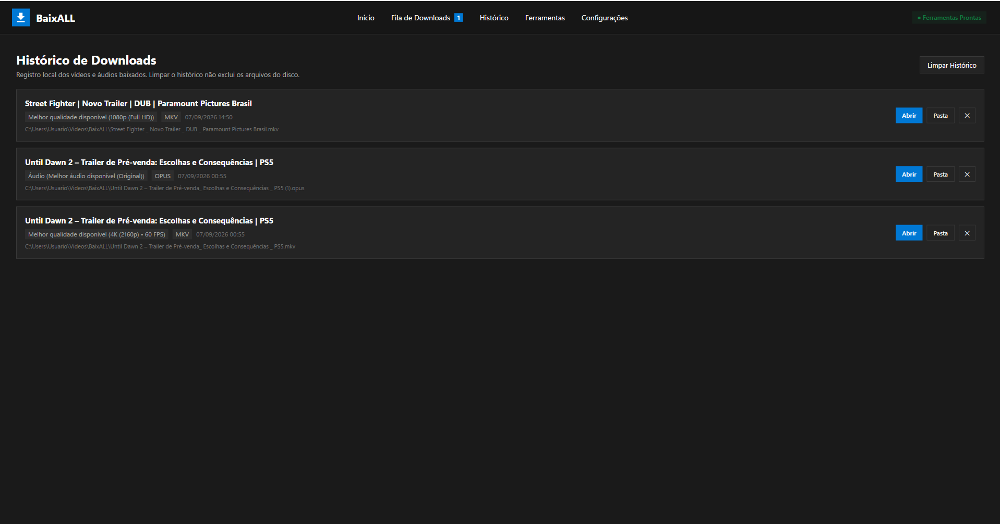
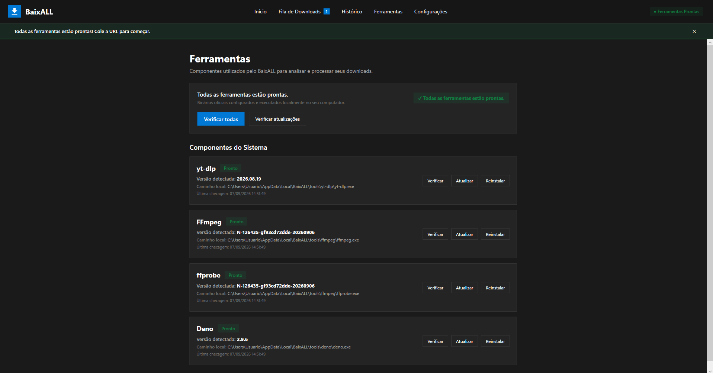

# BaixALL

  <strong>Aplicativo desktop para Windows que permite baixar vídeos e áudios na qualidade selecionada, com suporte a yt-dlp, FFmpeg, fila com downloads simultâneos e gerenciamento automático de ferramentas.</strong>

  
  
  
  

  
   
  <a href="https://github.com/ArkanjoV2/BaixALL/releases/download/v1.0.0/BaixALL-1.0.0-win-x64.zip">
    <em>Ou baixe a Versão Portátil (.ZIP)</em>
  </a>
  &nbsp;•&nbsp;
  <a href="https://github.com/ArkanjoV2/BaixALL/releases/download/v1.0.0/checksums.txt">
    <em>Verificar Hashes SHA-256</em>
  </a>

---

## 📋 Sumário

- [Visão Geral](#-visão-geral)
- [Apresentação da Interface](#-apresentação-da-interface)
- [Recursos Principais](#-recursos-principais)
- [Requisitos do Sistema](#-requisitos-do-sistema)
- [Instalação](#-instalação)
- [Como Utilizar](#-como-utilizar)
  - [1. Analisar e Baixar um Vídeo](#1-analisar-e-baixar-um-vídeo)
  - [2. Selecionar Qualidade e Formato](#2-selecionar-qualidade-e-formato)
  - [3. Baixar Somente Áudio](#3-baixar-somente-áudio)
  - [4. Fila com Downloads Simultâneos](#4-fila-com-downloads-simultâneos)
  - [5. Acessar o Histórico](#5-acessar-o-histórico)
  - [6. Atualizar as Ferramentas](#6-atualizar-as-ferramentas)
- [Limitações Conhecidas](#-limitações-conhecidas)
- [Como Relatar Problemas e Obter Suporte](#-como-relatar-problemas-e-obter-suporte)
- [Licença e Créditos](#-licença-e-créditos)

---

## 💡 Visão Geral

O **BaixALL** é um aplicativo desktop nativo desenvolvido em **C#** e **.NET 10** com interface gráfica em **WPF** (padrão MVVM). Criado para oferecer um fluxo prático e transparente, ele integra ferramentas consagradas de código aberto (**yt-dlp**, **FFmpeg** e **Deno**) em um único executável, sem anúncios, sem telemetria e com processamento local no seu computador.

---

## 🖥️ Apresentação da Interface

Interface nativa do BaixALL focada em clareza, produtividade e feedback em tempo real:

### Tela Principal — Análise de Vídeo e Opções de Download

*Análise imediata da URL com exibição de miniatura em alta resolução, título, duração, taxas disponíveis e formulário de configuração.*

 

| Seleção de Qualidade e Formato | Fila de Downloads em Tempo Real |
| :---: | :---: |
|  Menu inteligente de resoluções (144p até 4K) e opções de container |  Progresso percentual, taxa de transferência e cancelamento individual |
| **Histórico Local de Downloads** | **Gerenciamento de Ferramentas** |
|  Registro local das conclusões com atalhos para abrir mídia ou pasta |  Status operacional e versão de yt-dlp, FFmpeg, ffprobe e Deno |

> 📸 *Todas as capturas acima foram obtidas diretamente da versão oficial 1.0.0 em ambiente Windows. Detalhes técnicos e diretrizes de atualização estão documentados em [docs/screenshots/README.md](docs/screenshots/README.md).*

---

## ✨ Recursos Principais

- **Download com Mesclagem Automática:** Identifica os fluxos de vídeo e áudio fornecidos separadamente pela plataforma e realiza a junção nos containers **MP4** ou **MKV** utilizando o FFmpeg.
- **Seleção de Resolução e FPS:** Escolha resoluções entre 360p e 4K (2160p), com suporte à taxa de 60 FPS quando oferecida pelo provedor de mídia.
- **Modo Somente Áudio:** Extraia o áudio preservando o fluxo original (M4A/AAC ou Opus) ou realize a conversão para **MP3** (320 kbps estéreo) para maior compatibilidade com reprodutores diversos.
- **Fila com Concorrência Configurável:** Enfileire múltiplos downloads sucessivamente com controle de 1, 2 ou 3 downloads concorrentes na aba Configurações.
- **Cancelamento Individual:** Interrompa um download específico em andamento sem interferir nos demais itens ativos da fila, removendo arquivos temporários parciais (`.part`, `.ytdl`).
- **Histórico Local:** Gravação das conclusões em arquivo JSON local (`%LOCALAPPDATA%\BaixALL\history.json`), com atalhos para abrir o arquivo de mídia ou localizá-lo na pasta de destino.
- **Gerenciamento Automático de Ferramentas:** Detecta, baixa e atualiza `yt-dlp`, `FFmpeg`, `ffprobe` e `Deno` diretamente dos lançamentos oficiais do GitHub, mantidos em diretório isolado do usuário (`%LOCALAPPDATA%\BaixALL\tools`) sem modificar o `PATH` do sistema operacional.
- **Distribuição Autônoma (Self-Contained):** O runtime .NET 10 LTS já está embutido no aplicativo. Não é necessária a instalação prévia de .NET SDK, Python, Node.js ou Visual Studio.
- **Interface em Português:** Estilo visual moderno inspirado no Fluent Design do Windows 11, com suporte nativo a temas Claro e Escuro.

---

## 💻 Requisitos do Sistema

- **Arquitetura:** 64-bit (x64 / AMD64).
- **Sistema Operacional:**
  - **Windows 11 (64-bit):** Totalmente suportado (sistema operacional com suporte oficial ativo pela Microsoft).
  - **Windows 10 (64-bit):** Recomendado para versões mantidas no ciclo de suporte oficial da Microsoft (como edições 22H2 dentro do período de atualização ou canais LTSC corporativos).
  - *Nota sobre versões legadas:* Embora o aplicativo seja tecnicamente executável em compilações x64 do Windows 10 a partir da versão 1809 (build 17763), o suporte e correções de segurança do sistema operacional dependem das políticas oficiais de ciclo de vida da Microsoft.
- **Runtimes Externos:** Nenhum runtime adicional é necessário (binários autônomos embutidos).
- **Espaço Livre em Disco:** Mínimo de 300 MB livres para a aplicação e ferramentas de apoio, além do espaço livre necessário para as mídias baixadas.
- **Conexão:** Acesso à internet para análise e download de links e ferramentas.

---

## 🚀 Instalação

Para instruções completas passo a passo, consulte o [Guia de Instalação](docs/GUIA_INSTALACAO.md).

### Opção 1: Instalador Oficial (Recomendado)
1. Baixe o instalador oficial: [BaixALL-Setup-1.0.0.exe](https://github.com/ArkanjoV2/BaixALL/releases/download/v1.0.0/BaixALL-Setup-1.0.0.exe).
2. Execute o assistente de instalação e selecione se deseja criar atalhos na Área de Trabalho e no Menu Iniciar.
3. A instalação é realizada na pasta do usuário (`%LOCALAPPDATA%\Programs\BaixALL`) sem exigir privilégios de administrador.

### Opção 2: Pacote Portátil
1. Baixe o arquivo compactado: [BaixALL-1.0.0-win-x64.zip](https://github.com/ArkanjoV2/BaixALL/releases/download/v1.0.0/BaixALL-1.0.0-win-x64.zip).
2. Extraia o conteúdo para a pasta de sua preferência.
3. Execute diretamente o arquivo `BaixALL.exe`.

> 🛡️ **Orientações de Segurança sobre o Windows SmartScreen:**  
> Ao executar o instalador ou executável em novas máquinas, o Windows Defender SmartScreen pode exibir um alerta de reputação (*"O Windows protegeu o seu computador"*). Isso ocorre porque programas recém-lançados ainda não acumularam histórico estatístico suficiente nos servidores da Microsoft.
> - **Recomendação de segurança:** Sempre confirme que você baixou o arquivo da [Release oficial](https://github.com/ArkanjoV2/BaixALL/releases/tag/v1.0.0) e compare o hash SHA-256 com o arquivo [checksums.txt](https://github.com/ArkanjoV2/BaixALL/releases/download/v1.0.0/checksums.txt).
> - **Não execute o arquivo se tiver dúvidas sobre sua autenticidade ou integridade.**
> - O BaixALL não desabilita defesas do Windows e não utiliza certificados fictícios. Consulte a explicação detalhada no [Guia de Instalação](docs/GUIA_INSTALACAO.md#3-avisos-de-reputação-do-windows-smartscreen).

---

## 📖 Como Utilizar

### 1. Analisar e Baixar um Vídeo
1. Copie o endereço (URL) do vídeo do YouTube no navegador.
2. Na aba inicial **Downloader** do BaixALL, cole o link no campo de entrada e clique em **"Analisar"** (ou pressione `Enter`).
3. O aplicativo consultará os dados do vídeo e exibirá título, canal, miniatura e duração.
4. Escolha a configuração desejada e clique em **"Baixar Vídeo"** (ou **"Baixar Áudio"**) para enviar à fila.

### 2. Selecionar Qualidade e Formato
- **"Melhor qualidade disponível" (Padrão):** O aplicativo seleciona a melhor faixa de vídeo e a melhor faixa de áudio disponibilizadas, unindo-as com o FFmpeg.
- **Resoluções personalizadas:** Selecione resoluções como 2160p (4K), 1440p (2K), 1080p, 720p, etc., com identificação de 60 FPS quando disponível.
- **Container:** Opções em **MP4** (ampla compatibilidade com reprodutores e dispositivos móveis) ou **MKV**.

### 3. Baixar Somente Áudio
1. Marque a caixa de seleção **"Somente Áudio"** na tela inicial.
2. Selecione o formato desejado:
   - **Melhor áudio disponível (Original):** Mantém a faixa de áudio original sem recodificação (geralmente M4A/AAC ou Opus em WebM).
   - **M4A:** Codec AAC em container MP4, recomendado para dispositivos Apple e reprodutores comuns.
   - **Opus:** Codec de alta fidelidade e compressão eficiente.
   - **MP3:** Conversão em 320 kbps estéreo via FFmpeg para compatibilidade ampla.

### 4. Fila com Downloads Simultâneos
- Acesse a aba **Fila** para acompanhar os itens ativos com barra de progresso, percentual, velocidade estimada e tamanho transferido.
- Na aba **Configurações**, configure o limite de downloads simultâneos (1, 2 ou 3). Ao concluir um download, o próximo item aguardando inicia automaticamente.
- Clicar no botão **"Cancelar"** encerra imediatamente aquele processo e remove arquivos temporários parciais, mantendo intactos os outros downloads ativos.

### 5. Acessar o Histórico
- Na aba **Histórico**, visualize a listagem de mídias concluídas.
- Utilize o botão **"Abrir arquivo"** para reproduzir a mídia no aplicativo padrão do Windows ou **"Abrir pasta"** para localizá-la no Windows Explorer.
- O botão **"Limpar Histórico"** remove os registros visuais sem apagar os arquivos físicos do disco.

### 6. Atualizar as Ferramentas
O YouTube atualiza periodicamente seus formatos e regras de entrega de mídia.
- Acesse a aba **Ferramentas** (ou **Configurações**) e clique em **"Verificar Atualizações"**.
- O aplicativo consultará os lançamentos oficiais e atualizará `yt-dlp`, `FFmpeg` ou `Deno` de forma atômica e segura.

---

## ⚠️ Limitações Conhecidas

- **Disponibilidade no YouTube:** O BaixALL depende da disponibilidade dos vídeos e da capacidade técnica do motor `yt-dlp`. Vídeos privados, vídeos restritos por região geográfica, conteúdos com proteção comercial por DRM ou com exigência de login com desafios severos de verificação humana não são suportados. **Não há promessa de compatibilidade universal com todo e qualquer vídeo.**
- **Atualização das Ferramentas:** Caso uma URL apresente falha na análise, utilize a aba **Ferramentas** para atualizar o `yt-dlp` antes de abrir um chamado de suporte.
- **Conexão de Rede:** Quedas de conexão prolongadas durante downloads pesados podem exigir o reinício do download correspondente.

---

## 💬 Como Relatar Problemas e Obter Suporte

- **Encontrou um erro ou falha?** Abra um [Relato de Bug](https://github.com/ArkanjoV2/BaixALL/issues/new?template=bug_report.yml).
- **Tem uma sugestão de melhoria?** Abra uma [Sugestão de Funcionalidade](https://github.com/ArkanjoV2/BaixALL/issues/new?template=feature_request.yml).
- **Orientações gerais de suporte:** Consulte nosso [Guia de Suporte](SUPPORT.md).
- **Relatório Privado de Vulnerabilidades:** Consulte a nossa política de divulgação responsável em [SECURITY.md](SECURITY.md).

---

## 📜 Licença e Créditos

- **BaixALL:** Distribuído sob a licença **MIT** (consulte o arquivo [LICENSE](LICENSE)).
- **Componentes de Terceiros:** Utiliza `yt-dlp` (Unlicense), `FFmpeg` / `ffprobe` (GPLv3), `Deno` (MIT) e bibliotecas .NET (MIT/Apache 2.0). Detalhes sobre limites de processo, compilação e conformidade legal com a GPLv3 estão formalmente documentados em [THIRD-PARTY-NOTICES.md](THIRD-PARTY-NOTICES.md).

---

  BaixALL — Desenvolvido de forma independente para arquivamento pessoal e interoperabilidade técnica.

