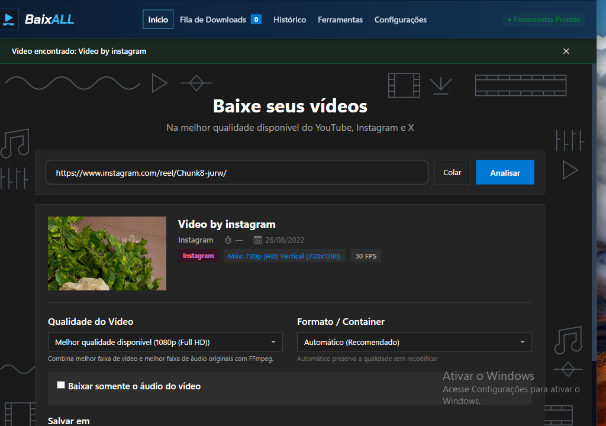
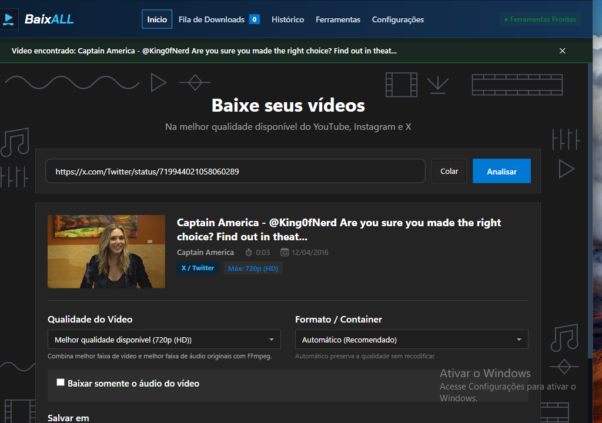
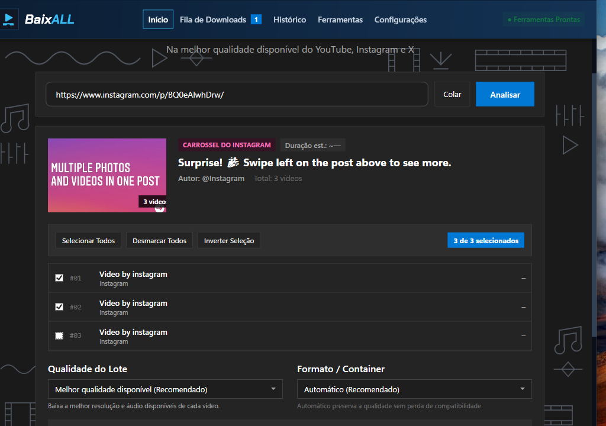
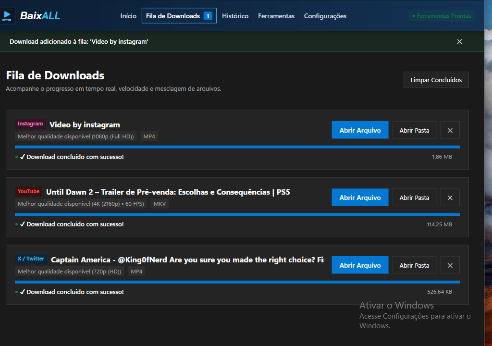
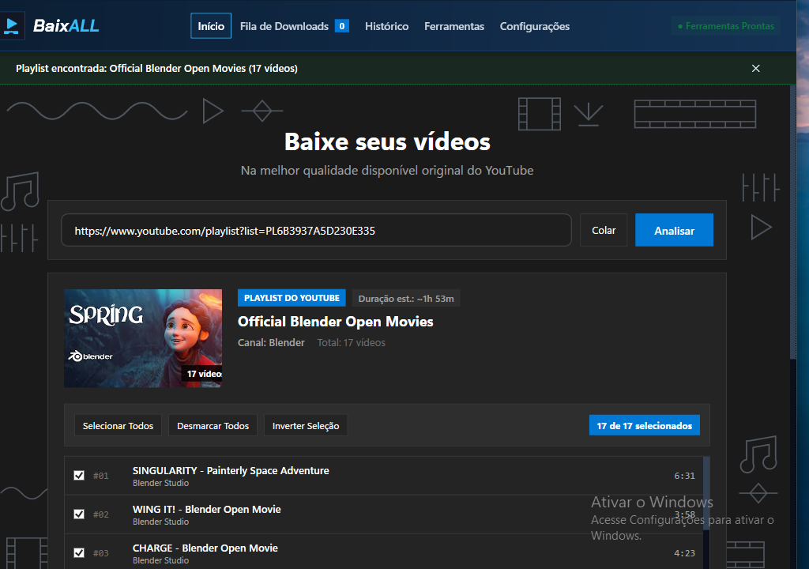
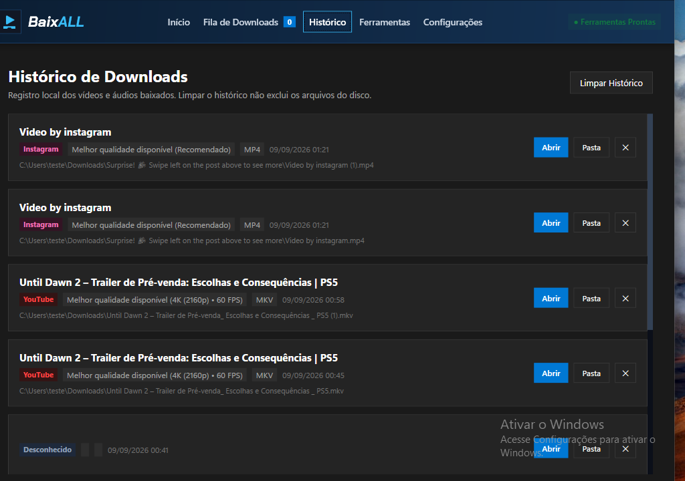

# BaixALL

  <strong>Aplicativo desktop para Windows para baixar vídeos e áudios de YouTube, Instagram e X/Twitter, com seleção de qualidade, suporte a playlists e carrosséis, fila global com downloads concorrentes e gerenciamento automático de ferramentas.</strong>

  
  
  
  

  
   
  <a href="https://github.com/ArkanjoV2/BaixALL/releases/download/v1.3.0/BaixALL-1.3.0-win-x64.zip">
    <em>Ou baixe a Versão Portátil (.ZIP)</em>
  </a>
  &nbsp;•&nbsp;
  <a href="https://github.com/ArkanjoV2/BaixALL/releases/download/v1.3.0/checksums-1.3.0.txt">
    <em>Verificar Hashes SHA-256</em>
  </a>

---

## 📋 Sumário

- [Visão Geral](#-visão-geral)
- [Apresentação da Interface](#-apresentação-da-interface)
- [Recursos Principais](#-recursos-principais)
- [Requisitos do Sistema](#-requisitos-do-sistema)
- [Instalação e Download Oficial](#-instalação-e-download-oficial)
- [Como Utilizar](#-como-utilizar)
  - [1. Analisar e Baixar um Vídeo do YouTube](#1-analisar-e-baixar-um-vídeo-do-youtube)
  - [2. Baixar um Reel ou Vídeo do Instagram](#2-baixar-um-reel-ou-vídeo-do-instagram)
  - [3. Baixar Carrosséis com Múltiplos Vídeos](#3-baixar-carrosséis-com-múltiplos-vídeos)
  - [4. Baixar um Vídeo ou GIF do X/Twitter](#4-baixar-um-vídeo-ou-gif-do-xtwitter)
  - [5. Fila Global e Controle de Concorrência](#5-fila-global-e-controle-de-concorrência)
  - [6. Playlists do YouTube e Downloads em Lote](#6-playlists-do-youtube-e-downloads-em-lote)
  - [7. Histórico e Gerenciamento de Arquivos](#7-histórico-e-gerenciamento-de-arquivos)
  - [8. Atualização das Ferramentas Auxiliares](#8-atualização-das-ferramentas-auxiliares)
- [Limitações Conhecidas](#-limitações-conhecidas)
- [Como Relatar Problemas e Obter Suporte](#-como-relatar-problemas-e-obter-suporte)
- [Licença e Créditos](#-licença-e-créditos)

---

## 💡 Visão Geral

O **BaixALL** é um aplicativo desktop nativo desenvolvido em **C#** e **.NET 10** com interface gráfica moderna em **WPF** (padrão MVVM). Criado para oferecer um fluxo prático, transparente e unificado de arquivamento pessoal, ele integra os motores de código aberto **yt-dlp**, **FFmpeg** e **Deno** em um executável autônomo.

A versão **1.3.0** introduz o suporte multiplataforma nativo a **Instagram** e **X/Twitter**, permitindo analisar e baixar conteúdos públicos das três principais plataformas em uma única interface, com identificação automática de links, fila integrada e histórico consolidado.

---

## 🖥️ Apresentação da Interface

Interface projetada com foco em clareza, ergonomia visual e feedback operacional em tempo real:

### Análise Multiplataforma (Novidade v1.3.0)

| Instagram Reel | X / Twitter Vídeo |
| :---: | :---: |
|  Identificação automática com badge rosa `Instagram`, miniatura real e opções de container |  Detecção automática com badge ciano `X / Twitter`, resolução máxima e download em MP4 |
| **Carrosséis com Múltiplos Vídeos (Instagram)** | **Fila Multiplataforma Integrada** |
|  Seleção individual por vídeo, contadores de mídia e aviso informativo para fotos estáticas |  Downloads de Instagram, YouTube e X convivendo na mesma fila com ações individuais |

 

### YouTube, Playlists e Ferramentas

| Playlists e Lotes do YouTube | Histórico Multiplataforma |
| :---: | :---: |
|  Seleção granular de itens, botões em lote e subpasta automática |  Registro com badges por plataforma, data, formato e atalhos rápidos |
| **Seleção de Resoluções e Áudio** | **Gerenciador de Ferramentas** |
|  Menu inteligente de resoluções (144p até 4K) e containers MP4/MKV |  Status operacional e versão de yt-dlp, FFmpeg, ffprobe e Deno |

> 📸 *Todas as capturas acima foram obtidas diretamente de execuções oficiais em ambiente Windows 11 x64. Consulte [docs/screenshots/README.md](docs/screenshots/README.md) para detalhes técnicos.*

---

## 📚 Recursos Principais

- **Suporte Multiplataforma:** Baixe vídeos públicos do **YouTube**, **Instagram** (Reels, posts e carrosséis) e **X/Twitter** (vídeos e GIFs animados).
- **Identificação Automática de Plataforma:** Ao colar qualquer URL suportada, o BaixALL identifica a plataforma e aplica badges coloridos (`YouTube`, `Instagram`, `X / Twitter`) na análise, na fila e no histórico.
- **Carrosséis e Coleções Granulares:** Em publicações com múltiplas mídias (Instagram) ou playlists (YouTube), escolha exatamente quais vídeos deseja baixar por meio de caixas de seleção, com botões para **Selecionar Todos**, **Desmarcar Todos** e **Inverter Seleção**.
- **Mesclagem Automática com FFmpeg:** Combina automaticamente as melhores faixas de vídeo e áudio em containers universais (**MP4** ou **MKV**).
- **Modo Somente Áudio:** Extraia o áudio original (M4A/AAC ou Opus) ou realize a conversão direta para **MP3** (320 kbps estéreo).
- **Fila Global com Concorrência Configurável:** Controle a taxa de downloads concorrentes (1, 2 ou 3 simultâneos na aba Configurações).
- **Cancelamento Preciso:** Botão **Cancelar** por item individual e **Cancelar Lote** por coleção, garantindo a exclusão imediata de arquivos temporários parciais (`.part`, `.ytdl`).
- **Diálogo de Fechamento Preventivo:** Ao tentar fechar a aplicação com downloads ativos ou pendentes, um aviso de confirmação oferece as opções **Não** (mantém o download em execução) e **Sim** (cancela e fecha de forma limpa, sem processos órfãos).
- **Histórico Local e Rastreabilidade:** Histórico salvo localmente em `%LOCALAPPDATA%\BaixALL\history.json` com chaves canônicas exclusivas (`yt:ID`, `ig:ID`, `x:ID`) e atalhos para abrir o arquivo ou localizá-lo no Explorer.
- **Gerenciador Integrado de Ferramentas:** Detecta, instala e atualiza `yt-dlp`, `FFmpeg`, `ffprobe` e `Deno` em pasta isolada do usuário (`%LOCALAPPDATA%\BaixALL\tools`), sem alterar o `PATH` do sistema.
- **Interface Fluent Design:** Temas Escuro (Dark) e Claro (Light) nativos, com suporte completo ao idioma Português do Brasil.
- **Distribuição Autônoma (Self-Contained):** O runtime .NET 10 LTS já está embutido. Não requer .NET SDK, Python, Node.js ou Visual Studio pré-instalados.

---

## 💻 Requisitos do Sistema

- **Arquitetura:** Processador de 64 bits (x64 / AMD64).
- **Sistema Operacional:**
  - **Windows 11 (64-bit):** Totalmente suportado (sistema com suporte oficial ativo pela Microsoft).
  - **Windows 10 (64-bit):** Recomendado para versões no ciclo de suporte oficial (ex.: 22H2 atualizado ou canais LTSC corporativos).
  - *Compatibilidade técnica:* Requer Windows 10 build 17763 (versão 1809) ou superior.
- **Runtimes Externos:** Nenhum runtime adicional é necessário (binários autônomos embutidos).
- **Espaço Livre em Disco:** Mínimo de 300 MB livres para o aplicativo e ferramentas auxiliares, além do espaço livre necessário para as mídias baixadas.
- **Conexão:** Acesso à internet para análise e download das mídias.

---

## 🚀 Instalação e Download Oficial

Consulte o [Guia de Instalação](docs/GUIA_INSTALACAO.md) para o passo a passo ilustrado.

### Pacotes Oficiais da Versão 1.3.0

| Pacote | Link de Download | Descrição |
| :--- | :--- | :--- |
| **Instalador Oficial (Setup)** | [Baixar BaixALL-Setup-1.3.0.exe](https://github.com/ArkanjoV2/BaixALL/releases/download/v1.3.0/BaixALL-Setup-1.3.0.exe) | Assistente completo com atalhos e desinstalador |
| **Versão Portátil (.ZIP)** | [Baixar BaixALL-1.3.0-win-x64.zip](https://github.com/ArkanjoV2/BaixALL/releases/download/v1.3.0/BaixALL-1.3.0-win-x64.zip) | Execução direta sem necessidade de instalação |
| **Manifesto de Hashes** | [Baixar checksums-1.3.0.txt](https://github.com/ArkanjoV2/BaixALL/releases/download/v1.3.0/checksums-1.3.0.txt) | Hashes criptográficos oficiais SHA-256 |

### Tabela de Integridade Criptográfica (SHA-256)

| Arquivo | Tamanho Exato | Hash SHA-256 Oficial |
| :--- | :---: | :--- |
| `BaixALL-Setup-1.3.0.exe` | 45.890.001 bytes | `b434214ae7b121347f034d0e0bbc74d708688b48d2bcce5e6eeb879b999985c8` |
| `BaixALL-1.3.0-win-x64.zip` | 65.504.526 bytes | `2310927586a61f8155944f5a2636399fdba7cf24c0f52e5fbd534c02699d6b01` |
| `checksums-1.3.0.txt` | 185 bytes | `1823e861154b9197c5529d41b3cca61619c3d57c3e3041ab6e4a745cdb6eb0d7` |

> 🛡️ **Orientações de Segurança sobre o Windows SmartScreen:**  
> Programas independentes de código aberto recém-lançados podem apresentar um aviso de reputação do Windows Defender SmartScreen (*"O Windows protegeu o seu computador"*).  
> - **Recomendação:** Sempre confirme que você baixou o arquivo da [Release oficial v1.3.0](https://github.com/ArkanjoV2/BaixALL/releases/tag/v1.3.0) e compare o hash SHA-256 com os valores da tabela acima via PowerShell (`Get-FileHash <arquivo> -Algorithm SHA256`).  
> - Não desative defesas do sistema operacional. Consulte as orientações no [Guia de Instalação](docs/GUIA_INSTALACAO.md#4-avisos-de-reputação-do-windows-defender-smartscreen).

---

## 📖 Como Utilizar

### 1. Analisar e Baixar um Vídeo do YouTube
1. Copie o endereço do vídeo no navegador.
2. Na tela inicial do BaixALL, cole o link no campo de entrada e clique em **"Analisar"** (ou pressione `Enter`).
3. Escolha a resolução desejada (ou selecione a opção padrão **"Melhor qualidade disponível"**).
4. Clique em **"Baixar Agora"** (ou **"Baixar Áudio"**) para enviar à fila.

### 2. Baixar um Reel ou Vídeo do Instagram
1. Copie o link do Reel (`instagram.com/reel/...`) ou do post com vídeo (`instagram.com/p/...`).
2. Cole no campo de entrada e clique em **"Analisar"**. O BaixALL identifica a plataforma exibindo o badge rosa `Instagram`.
3. Escolha a qualidade e o container desejados e clique em **"Baixar Agora"**.

### 3. Baixar Carrosséis com Múltiplos Vídeos
1. Cole a URL do post carrossel do Instagram contendo múltiplos vídeos.
2. O BaixALL exibe o badge `CARROSSEL DO INSTAGRAM`, o número total de mídias e a lista dos vídeos encontrados.
3. Marque ou desmarque os vídeos desejados individualmente ou use os botões **"Selecionar Todos"** / **"Desmarcar Todos"**.
   - *Nota:* Imagens estáticas são automaticamente desabilitadas com aviso visual informativo.
4. Clique em **"Adicionar Vídeos Selecionados à Fila"**. Os arquivos serão organizados em uma subpasta automática com a legenda do post.

### 4. Baixar um Vídeo ou GIF do X/Twitter
1. Copie o link do tweet/post (`x.com/...` ou `twitter.com/...`).
2. Cole no campo de entrada e clique em **"Analisar"**. O aplicativo identifica a plataforma com o badge ciano `X / Twitter`.
3. Posts com GIFs animados são automaticamente processados como arquivos de vídeo MP4.
4. Clique em **"Baixar Agora"**.
   - *Nota:* Publicações que contenham apenas texto ou imagens estáticas exibem uma mensagem informativa em português.

### 5. Fila Global e Controle de Concorrência
- A aba **Fila de Downloads** centraliza itens de todas as plataformas com seus respectivos badges.
- Acompanhe em tempo real a velocidade, o percentual, o tempo estimado (ETA) e o tamanho baixado.
- Na aba **Configurações**, ajuste o limite de downloads simultâneos (1, 2 ou 3).
- Utilize o botão **"Cancelar"** para interromper um item específico ou **"Cancelar Lote"** para interromper uma coleção inteira.

### 6. Playlists do YouTube e Downloads em Lote
1. Cole a URL de uma playlist do YouTube (`playlist?list=...`) ou um link híbrido.
2. Em links híbridos, escolha entre baixar apenas o vídeo avulso ou carregar a playlist inteira.
3. Selecione os itens desejados e clique em **"Adicionar à Fila"**. O progresso será acompanhado pelo painel de lote superior.

### 7. Histórico e Gerenciamento de Arquivos
- Acesse a aba **Histórico** para visualizar todas as conclusões com badges coloridos por plataforma.
- Utilize os botões **"Abrir"** para reproduzir a mídia no aplicativo padrão do Windows ou **"Pasta"** para abri-la no Explorer.
- O botão **"Limpar Histórico"** remove os registros visuais sem apagar os arquivos físicos do computador.

### 8. Atualização das Ferramentas Auxiliares
As plataformas frequentemente ajustam seus mecanismos de entrega de vídeo.
- Na aba **Ferramentas**, visualize o status e a versão de cada componente.
- Clique em **"Verificar Atualizações"** para atualizar `yt-dlp`, `FFmpeg` ou `Deno` de forma atômica e segura.

---

## ⚠️ Limitações Conhecidas

1. **Dependência de Extratores Upstream e Disponibilidade das Plataformas:**  
   O BaixALL baseia sua extração no projeto de código aberto `yt-dlp`. Alterações na infraestrutura das plataformas, restrições geográficas de IP ou medidas anti-scraping podem impactar temporariamente a análise até que novas versões dos componentes sejam atualizadas na aba *Ferramentas*. **Não há garantia de compatibilidade universal com toda e qualquer publicação.**
2. **Autenticação e Conteúdos Privados:**  
   Stories, contas privadas, conteúdos com restrição de idade, Spaces e perfis inteiros estão fora do escopo. Qualquer mídia que exija login retorna uma mensagem informativa; o aplicativo não solicita, não armazena e não utiliza credenciais ou cookies locais de navegadores.
3. **Fotos em Carrosséis:**  
   O BaixALL é projetado para download de mídia audiovisual. Fotos estáticas e imagens presentes em carrosséis são desabilitadas com aviso visual.
4. **Persistência da Fila entre Reinicializações:**  
   Itens pendentes ou downloads em andamento na fila não são persistidos caso o aplicativo seja fechado. Ao tentar encerrar com itens ativos, o diálogo de confirmação previne cancelamentos acidentais. O histórico de itens já concluídos e as configurações permanecem preservados no disco.
5. **Estabilidade de Conexão:**  
   Instabilidades de rede prolongadas durante downloads pesados podem exigir que o item correspondente seja enfileirado novamente.

---

## 💬 Como Relatar Problemas e Obter Suporte

- **Encontrou um erro ou falha?** Abra um [Relato de Bug](https://github.com/ArkanjoV2/BaixALL/issues/new?template=bug_report.yml).
- **Tem uma sugestão de melhoria?** Abra uma [Sugestão de Funcionalidade](https://github.com/ArkanjoV2/BaixALL/issues/new?template=feature_request.yml).
- **Orientações gerais de suporte:** Consulte nosso [Guia de Suporte](SUPPORT.md).
- **Relatório Privado de Vulnerabilidades:** Consulte a nossa política em [SECURITY.md](SECURITY.md).
- **Versões Anteriores:** As versões anteriores continuam arquivadas e disponíveis para consulta na página de [Releases](https://github.com/ArkanjoV2/BaixALL/releases).

---

## 📜 Licença e Créditos

- **BaixALL:** Distribuído sob a licença **MIT** (consulte o arquivo [LICENSE](LICENSE)).
- **Componentes de Terceiros:** Integra `yt-dlp` (Unlicense), `FFmpeg` / `ffprobe` (GPLv3), `Deno` (MIT) e bibliotecas .NET (MIT/Apache 2.0). Detalhes sobre isolamento de processo e conformidade legal com a GPLv3 estão formalmente documentados em [THIRD-PARTY-NOTICES.md](THIRD-PARTY-NOTICES.md).

---

  BaixALL — Desenvolvido de forma independente para arquivamento pessoal e interoperabilidade técnica.

